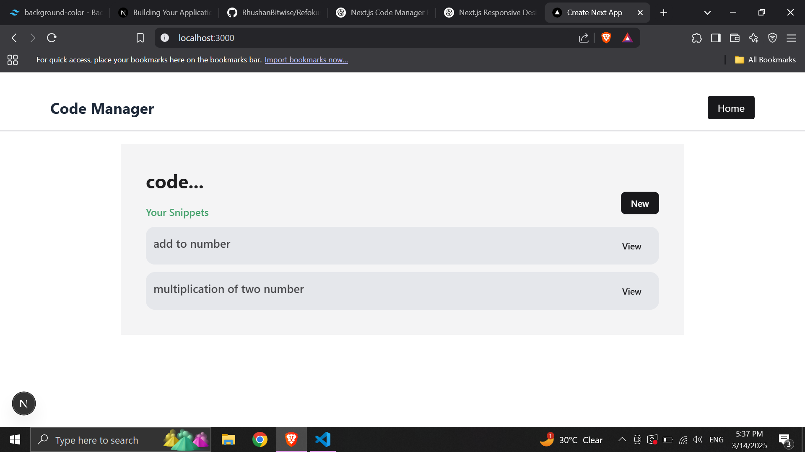
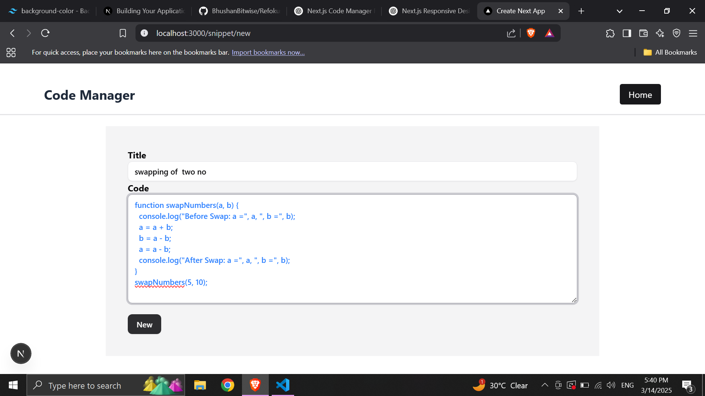
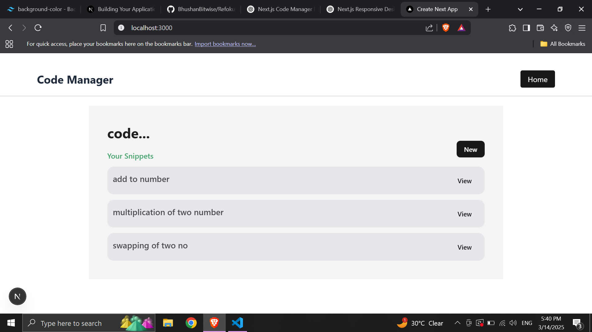
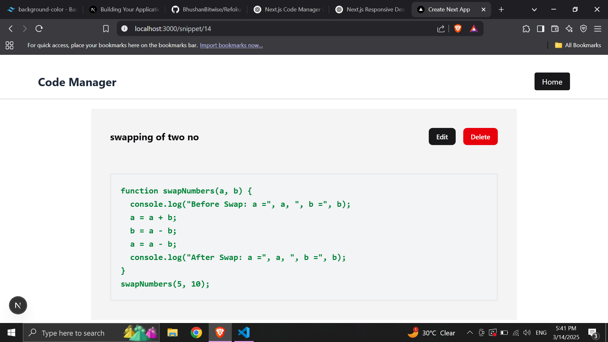
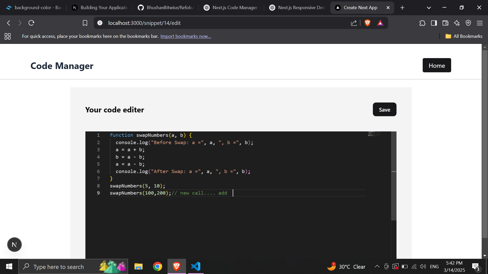
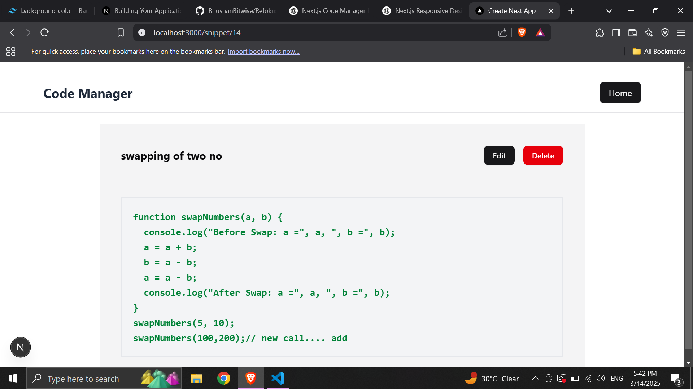

# Code Manager Application

# Overview
The Code Manager Application is a powerful mini project built with Next.js and SQLite, utilizing key concepts like file-based routing, page layouts, App Router, relative and absolute paths, Link components, CSR and SSR handling, client and server directives, server actions, dynamic route slugs, useActionState, error handling, caching strategies, and generateStaticParams.

## Core Advance Concepts Implemented

- **File-based Routing**:Seamless navigation through the Next.js file system.

- **Page Layouts**: Reusable and consistent UI across pages.

- **App Router**: Advanced routing capabilities.

- **Relative and Absolute Paths**: Flexible path handling.Shery.js.

- **CSR & SSR Understanding**: Optimized rendering strategies

- **Client and Server Directives**:  Clear separation of client and server components.

- **Server Actions & useActionState**: Handling server-side logic and managing state.

- **Dynamic Route Slugs**:  Flexible dynamic routing for code management.

- **Error Handling**:  Graceful error management.

- **Caching Mechanism**:  Utilizing Next.js powerful caching strategies.

- **generateStaticParams:**: Generating static parameters for dynamic routes..

- **SQLite Database Integration**: Efficient data storage and management.

<!-- 
## Screenshots

 -->
